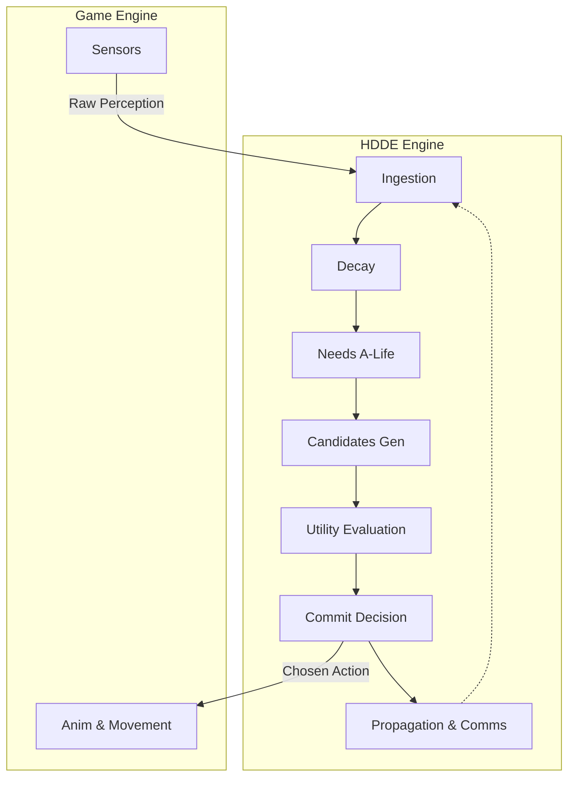

# HDDE: A Zero-Allocation Hierarchical Utility Architecture


A high-performance, purely data-oriented (ECS/SoA based) game AI engine written in Rust, designed to be seamlessly embedded into game engines via a C-API.

## 🧠 Architecture Overview

This engine implements a **Hierarchical Distributed Decision Engine (HDDE)**. It replaces traditional monolithic AI controllers (like Behavior Trees) with a 7-stage data pipeline running across flat arrays (Struct of Arrays).



### Key Features
- 🚀 **Zero Allocations**: All data is stored in pre-allocated static-size arrays (`SoARegistry`). No runtime heap allocations occur during the core update loop.
- 🧩 **Data-Oriented (SoA)**: Maximum CPU cache efficiency. Everything runs on tightly packed arrays.
- ⚖️ **Utility AI**: Replaces complex behavior trees with multiplicative considerations, providing smooth, unscripted emergent behaviors.
- 📡 **Hierarchical Propagation**: Bottom-up status reporting and top-down intent directives with simulated communication latency.
- 🧬 **A-Life Needs System**: Agents have internal needs (hunger, fatigue, curiosity, self-preservation) that naturally decay and affect their tactical utility scores over time, enabling offline open-world simulation.

## 🛠️ Building and Running

Ensure you have Rust installed.

```bash
# Compile the engine
cargo build --release

# Run the hierarchy simulation example
cargo run --example hdde_simulation
```

## 🎮 The C-API (Coming Soon)

A lightweight FFI interface designed for Unity and Unreal Engine integrations. Exposes a simple `hdde_engine_tick()` and `hdde_engine_push_events()` without bridging complex data types, preserving the zero-allocation philosophy.

## 📝 License

This project is licensed under the MIT License - see the [LICENSE](LICENSE) file for details.
